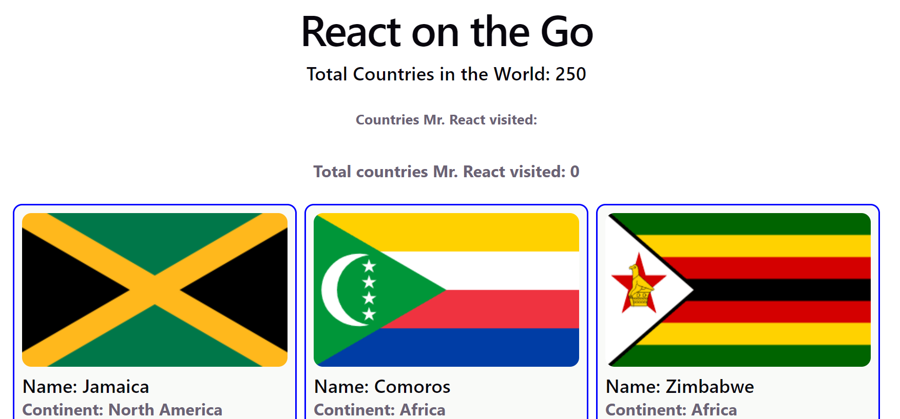
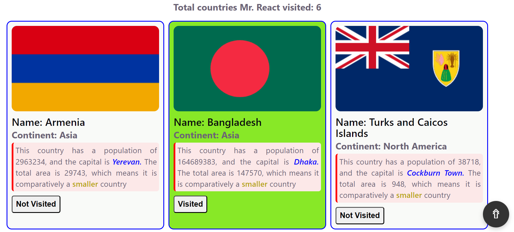
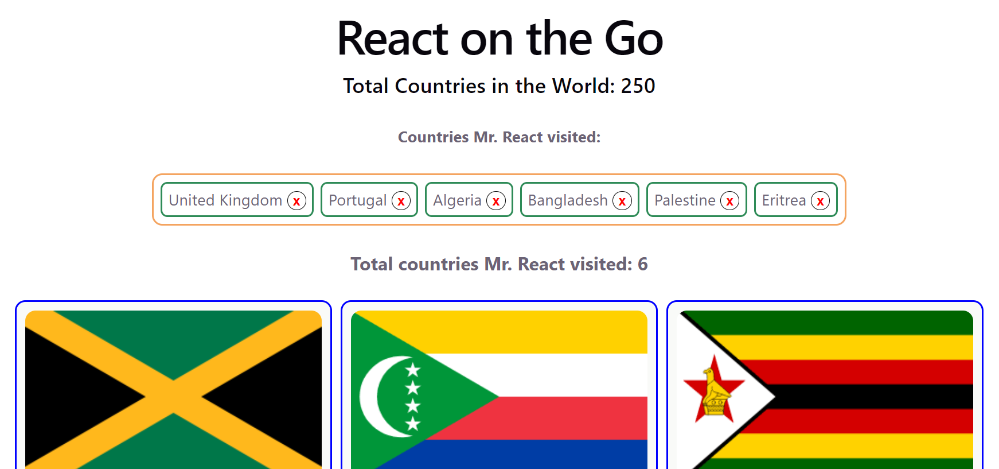

# 🚀 React on the Go

🔗 **Live Demo:** https://ahmedtonoy.github.io/React_on_the_Go/

---

## 📌 Overview

**React on the Go** is a modern React-based web application, where ***Mr. React*** can visit the whole world just using simple clicks on any country's `visit button`🥳🌍✈, designed to demonstrate core React concepts, component-based architecture, and dynamic UI rendering.

This project showcases how React enables the creation of fast, interactive, and reusable user interfaces for modern web applications. It highlights best practices in building scalable and maintainable single-page applications (SPAs).

---

## ✨ Features

* ⚛️ Component-based architecture
* 🔄 Dynamic rendering and state management
* 🎯 Clean and responsive UI
* ⚡ Fast performance with modern frontend practices
* 📦 Modular and scalable structure

---

## 🛠️ Tech Stack

| Technology            | Description                      |
| --------------------- | -------------------------------- |
| **React.js**          | Frontend library for building UI |
| **JavaScript (ES6+)** | Core programming language        |
| **HTML5 & CSS3**      | Structure and styling            |
| **GitHub Pages**      | Deployment platform              |

---

## 📷 Screenshots

***Initial preview***


***Marking a country as visited***


***Showing all visited country names and total visited count***


---

## ⚙️ Installation & Setup

To run this project locally:

```bash
# Clone the repository
git clone https://github.com/ahmedtonoy/React_on_the_Go.git

# Navigate into the project
cd React_on_the_Go

# Install dependencies
npm install

# Start the development server
npm start
```

---

## 🚀 Deployment

This project is deployed using **GitHub Pages**.

To deploy manually:

```bash
npm run build
npm run deploy
```

---

## 📁 Project Structure

```
React_on_the_Go/
│── public/
│── src/
│   ├── components/
│   ├── App.js
│   ├── index.js
│── package.json
│── README.md
```

---

## 🧠 Learning Outcomes

Through this project, you can learn:

* React fundamentals (components, props, state)
* UI structuring and reusability
* SPA behavior and rendering flow
* Project structuring for scalability

---

## 🤝 Contributing

Contributions are welcome!

If you'd like to improve this project:

1. Fork the repo
2. Create a new branch (`feature/your-feature`)
3. Commit your changes
4. Push to the branch
5. Open a Pull Request

---

## 📬 Contact

**Forkan Uddin Ahmed**
📧 [forkan1510699@gmail.com](mailto:forkan1510699@gmail.com)

---

## ⭐ Show Your Support

If you like this project:

* ⭐ Star the repo
* 🍴 Fork it
* 📢 Share it

---

## 📄 License

This project is licensed under the **MIT License**.
